# Details of the canon

## Description

Here is the details about the canon implemented in the the simulator. You can see which canon is used, what are its specifications and others. For details about the project, read the [Functional Specifications](../FunctionalSpecifications.md).

## Canon description

### Name
- 2A46M-5

### Tank using this canon (with it's version)
|  | T-64A | T-64B | T-64BV | T-72A | T-72AV | T-72B | T-72B3 | T-80B | T-80BV | T-80U | T-80BVM | T-90 series |
| --- | --- | --- | --- | --- | --- | --- | --- | --- | --- | --- | --- | --- |
| 2A46-1 | X |  |  | X |  
| 2A46-2 |  | X |  |  |  |  |  | X |
| 2A46M |  |  |  |  | X | X |
| 2A46M-1 |  |  | X |  |  | X |  |  | X | X | X |
| 2A46M-5 |  |  |  |  |  |  | X |  |  |  |  | X |

### Specifications
| General |  |
| --- | --- |
| Origin : | Russian |
| Date : | 1970-Today |

| Barrel/Ammunition |  |
| --- | --- |
| Caliber : | 125mm L/48 |
| Barrel length : | 6000 mm |
| Rifling : | Smoothbore |
| Fume Extractor : | Yes |
| Thermal sleeve : | Yes |
| Muzzle break : | No |
| Reliability : | 800 EFC<a href="#EFC">*</a> for 2A46 and 2A46M   600 to 1200 EFC for 2A46M-4/2A46M-5 |
| Ammunition type : | Two part ammunition |

| Capability |  |
| --- | --- |
| Fire rate : | 8 rpm<a href="#rpm">*</a> for [T-64 and T-80 autoloader](#t-64-and-t-80-autoloader)   7 rpm for [T-72 and T-90 autoloader](#t-72-and-t-90-autoloader)   1 to 4 rpm for emergency loading (manual loading) |
| Elevation angle : | From -5° to +15° |
| Recoil force : | 98,000 N |
| Recoil stroke : | 260-300 mm |
| Recoil assembly : | 2 asymmetrical buffers for the 2A46   2 symmetrical buffers for the 2A46M and later |
| Range : | up to 3220 m |

| Dimensions |  |
| --- | --- |
| Weight : | 2.45 t |
| Length : | 6383 mm |
| Charging chamber length : | 840 mm |

| Ammunition | Type | Material | Projectile weight | Projectile length | Total length | Velocity | Penetration |
| --- | --- | --- | --- | --- | --- | --- | --- |
| 3VBM23/3BM60 "Svinets-2" <a href="#3bm60">*</a> | APFSDS<a href="#rpm">*</a> | Tungsten alloy | 8.4 kg | 735 mm | 740 mm | 1660 m/s | 700 mm @ 2000 m, 0° in homogeneous steel   300 mm @ 2000 m, 60° in homogeneous steel

###### Source : [2A46M Documentation](#documentation-source) , [weaponsystems.net](https://weaponsystems.net/system/1509-125mm%202A46) , [bastion-karpenko.ru](https://bastion-karpenko.ru/?s=3bm60) , [https://fr.wiki5.ru](https://fr.wiki5.ru/wiki/125_mm_smoothbore_ammunition#3VBM22/3BM59_(3BM59_"Svinets-1"))

 

### Descriptive images
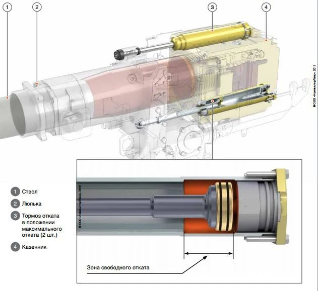
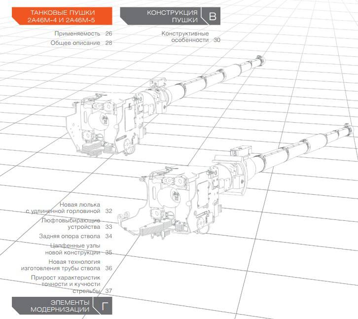
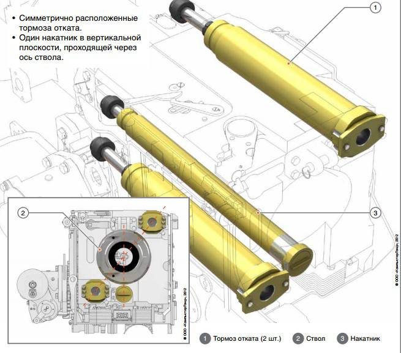
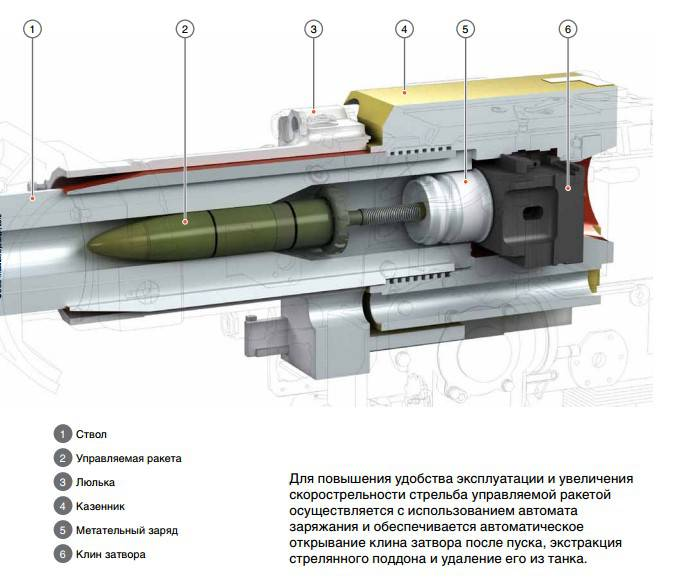
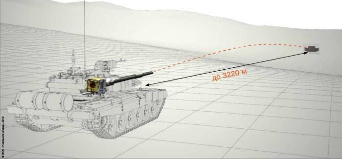

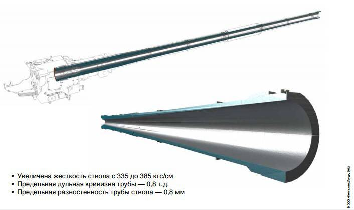

###### Source : [topwar.ru](https://fr.topwar.ru/57191-tankovye-pushki-2a46m-5-i-2a46m-4.html)

 

### Documentation source 
Original document from the Belarusian National University of Technology (BNUT) located in Minsk, Byelorussia in 2016.
[2A46M.pdf](125_mm_tankovaya_pushka_2A46M.pdf)

   

| Glossary |  |
| --- | --- |
| <h4 id="EFC">EFC :</h4> | Equivalent Full Charge, used to tell how many times the canon can be used at full power. |
| <h4 id="rpm">rpm :</h4> | Round Per Minute, how many rounds can be shot in one minute. |
| <h4 id="apfsds">APFSDS :</h4> | Armour-Piercing Fin-Stabilized Discarding Sabot |

 

### **Annex**

#### T-64 and T-80 autoloader
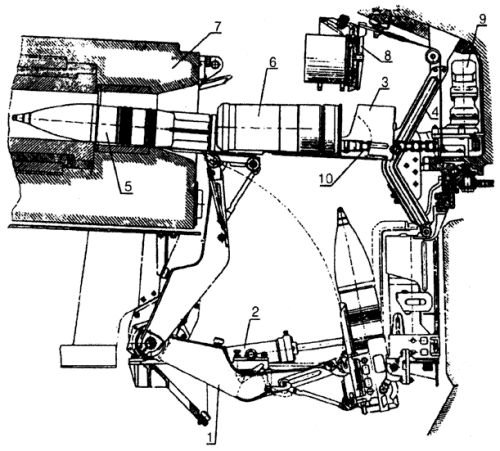

###### Source : [fofanov.armor.kiev.ua](http://fofanov.armor.kiev.ua/Tanks/EQP/al-80.html)

 

#### T-72 and T-90 autoloader
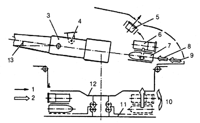
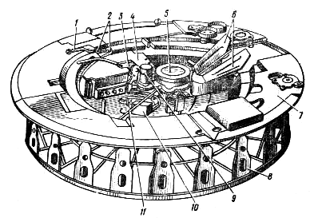

###### Source : [fofanov.armor.kiev.ua](http://fofanov.armor.kiev.ua/Tanks/EQP/al-72.html)

 

<h4 id="3bm60">3VBM23 / 3BM60 "Svinets-2"</h4>
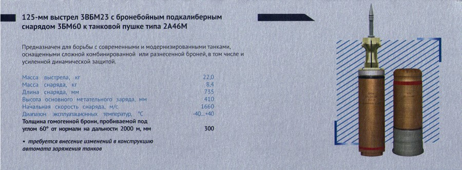
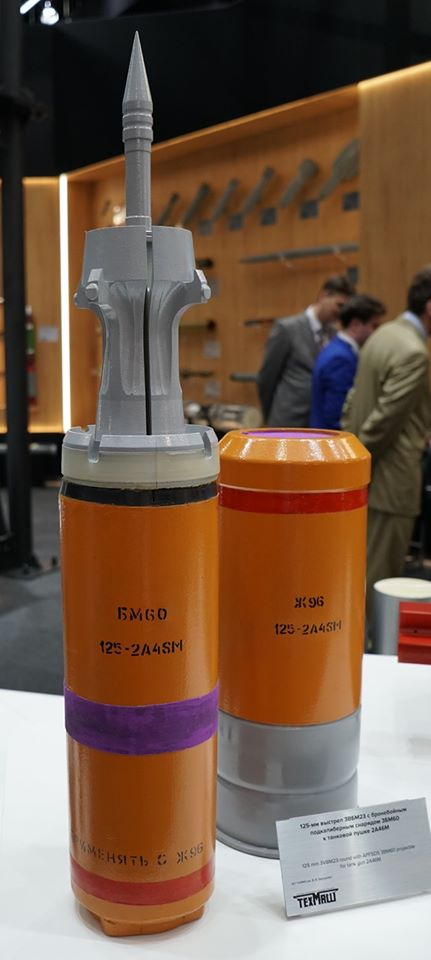
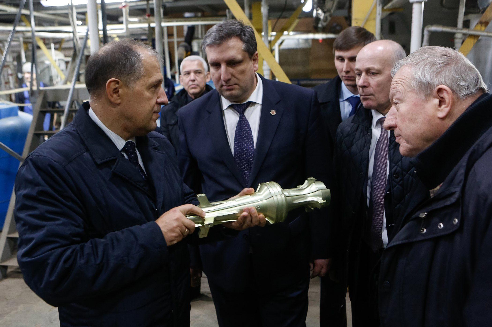

###### Source : [bastion-karpenko.ru](https://bastion-karpenko.ru/?s=3bm60) , [below-the-turret-ring.blogspot.com](https://below-the-turret-ring.blogspot.com/2016/10/russia-is-mass-producing-improved.html)