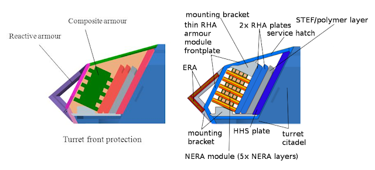

# Functional Specification

This functional specification is for the moonshot. For more information about the project, please look at the complete one, which describes the entire project.

    <h2 id="table of content">Table of content</h2>

<ul>
    <li><a href="#A_Project-Introduction">A) Project introduction<a></li>
    <ul>
        <li><a href="#1_Glossary">1) Glossary</a></li>
        <li><a href="#2_Project-Information">2) Project information<a></li>
        <ul>
            <li><a href="#Project-Overview">Project overview</a></li>
            <li><a href="#Objectives">Objectives</a></li>
            <li><a href="#Scope">Scope</a></li>
        </ul>  
    </ul>
    <li><a href="#B_Functional-Requirement">B) Functional requirement</a></li>
    <ul>
        <li><a href="#1_Simulation">1) Simulation</a></li>
        <ul>
            <li><a href="#Principle">Principle</a></li>
            <li><a href="#Complexity">Complexity</a></li>
        </ul>
        <li><a href="#2_Tanks-Details">2) Tanks details</a></li>
        <ul>
            <li><a href="#Armor">Armor</a></li>
            <li><a href="#Weight">Weight</a></li>
            <li><a href="#Mobility">Mobility</a></li>
            <li><a href="#Firepower">Firepower</a></li>
            <li><a href="#Others">Others</a></li>
        </ul>
    </ul>
</ul>

    <h2 id="A_Project-Introduction">A) Project introduction</h2>

<h3 id="1_Glossary">1) Glossary</h3>

| Term used | Definition |
|---|---|
| "Simulator" | Software that recreate the reality |
| "Tanks" | Armored vehicules, usualy mounted with a cannon and have tracks other than wheels |
|  |  |
| "Sprockets" | Parts of a tank that is connected to the transmission and transfer the movement from the transimssion to the tracks |
|  |  |
|  |  |
|  |  |
|  |  |
|  |  |
|  |  |
|  |  |
|  |  |

<h3 id="2_Project-Information">2) Poject information</h3>

<h4 id="Project-Overview">Project overview</h4>

The goal of this project is to make a tank simulator. The principle of it is to have the maximum immersion possible while having every detail that can be added to create a real simulator. It will be for everyone so classified documents will limit the amount of content.

<h4 id="Objectives">Objectives</h4>
    <ul>
        <li>Create a tank simulator</li>
        <li></li>
        <li></li>
    <ul>

<h4 id="Scope">Scope</h4>
This is for the moonshot goal, other goals will be clarified in an other document, for futur improvements.

| In scope |
|---|
| Have a working vehicle with basic mechanics and systems |
| Have a map to test everything (shooting range/training map) |

| Out of scope |
|---|
| Use classified documents |
| Do not work like a simulator |
| Use complete pre-made models/functions |
|  |

    <h2 id="B_Functional-Requirement">B) Functional Requirement</h2>

<h3 id="1_Simulation">1) Simulation</h3>

<h4 id="Principle">Principle</h4>
The goal of a simulator is to recreate as precisly as possible the reality. It means that everything has the be very close to how it works in the reality, depending on what is meant to recreate.

<h4 id="Complexity">Complexity</h4>

<h3 id="2_Tanks">2) Tanks</h3>
Tanks are very complex machines with a lot more technical specifications for the most modern vehicles than the first ones. Four main points have to be taken into account as shown here, but more technical specifications will be integrated in the future of the simulator.

<h4 id="Armor">- Armor</h4>
Tanks are, for most of them, equipped with heavy armor. For the most modern the armor has different layers, which are not there for nothing, but can have 100mm of armor effectiveness just by adding a panel of 30mm. It will be a complex part, because armor can redirect shells are just disintegrate the shell by taking into account the material used and other parameters.
  
<i>Example of composite armor on modern vehicles (here a chinese tank) :</i>

<h4 id="Weight">- Weight</h4>
Weight will not be a complex parameter to take into account, but its distribution will be important for the stability of the vehicles. Each armored vehicle has a different layout so the stability is not the same.

<h4 id="Mobility">- Mobility</h4>
For this to work, the weight, the engine power, the transmission, the sprockets, and the tracks (or wheels for wheeled vehicles) have to be taken into account. Those parameters are different for each vehicle because of the different materials and layout used for each one

<h4 id="Firepower">- Firepower</h4>
For the firepower, the type of cannon and shells used are the main parameters to take into account. Tho some tank uses autoloader and others use manual loader.

<h4 id="Others">Others</h4>
Gunner sight with fire system, commander sight, and commandant controls, driver view with driving systems are more other specifications will be implemented (more details on the complete functional specification).
