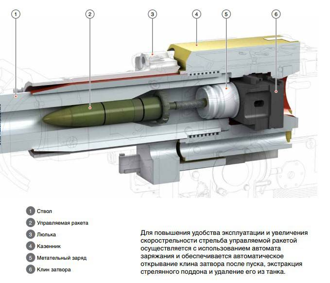
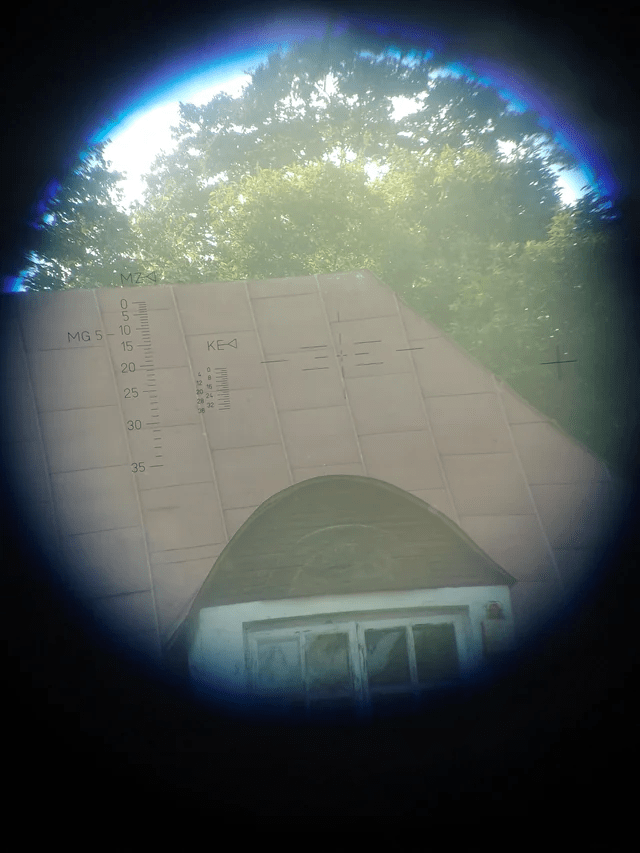
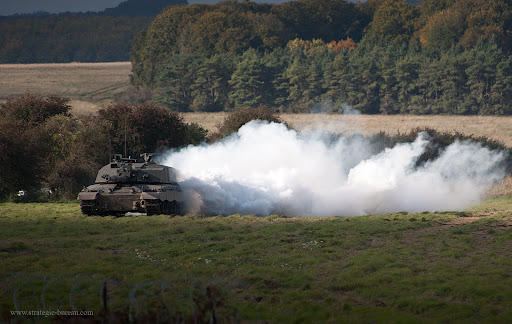

# Functional Specification

    <h2 id="table of content"><b>Table of content</b></h2>

<ul>
    <li><a href="#A_Project-Introduction">A) Project introduction<a></li>
    <ul>
        <li><a href="#1_Glossary">1) Glossary</a></li>
        <li><a href="#2_Project-Overview">2) Project overview<a></li>
        <ul>
            <li><a href="#Project-Information">Project information</a></li>
            <li><a href="#Objectives">Objectives</a></li>
            <ul>
                <li><a href="1Moonshot">Moonshot</a></li>
                <li><a href="1Complete">Complete</a></li>
            </ul>
            <li><a href="#Scope">Scope</a></li>
            <ul>
                <li><a href="2Moonshot">Moonshot</a></li>
                <li><a href="2Complete">Complete</a></li>
            </ul>
        </ul>  
    </ul>
    <li><a href="#B_Functional-Requirement">B) Functional requirement</a></li>
    <ul>
        <li><a href="#1_Simulation">1) Simulation</a></li>
        <li><a href="#2_Tanks-Details">2) Tanks details</a></li>
        <ul>
            <li><a href="#Basics">Basics</a></li>
            <ul>
                <li><a href="#Armor">Armor</a></li>
                <li><a href="#Weight">Weight</a></li>
                <li><a href="#Mobility">Mobility</a></li>
                <li><a href="#Firepower">Firepower</a></li>
            </ul>
            <li><a href="#Advanced">Advanced</a></li>
            <ul>
                <li><a href="#Systems_And_Crew">Systems and crew</a></li>
                <li><a href="#Firing_Control_System">Firing control system</a></li>
                <li><a href="#Sights">Sights</a></li>
                <li><a href="#Ammunition_Management">Ammunition management</a></li>
                <li><a href="#Protection_Systems">Protection systems</a></li>
            </ul>
        </ul>
        <li><a href="#3_Canon-Used">3) Canon used</a></li>
        <li><a href="#4_Personas_Definition">4) Personas definition</a></li>
    </ul>
    <li><a href="#C_Non-Functional-Requirement">C) Non functional requirement</a></li>
    <ul>
        <li><a href="#1_Costs">1) Cost</a></li>
        <ul>
            <li><a href="Expenditures">Expenditures</a></li>
            <li><a href="Time-Spent">Time Spent</a></li>
        </ul>
        <li><a href="#2_Reliability">2) Reliability</a></li>
        <li><a href="#3_Operability-And-Performance">3) Operability and performance</a></li>
        <li><a href="#4_Delivery">4) Delivery</a></li>
    </ul>
    <li><a href="#D_Annex">D) Annex</a></li>
</ul>

    <h2 id="A_Project-Introduction"><b>A) Project introduction</b></h2>

<h3 id="1_Glossary"><ins><b>1) Glossary</b></ins></h3>

| Term used | Definition |
|---|---|
| "Tanks" | Armored vehicles, usually mounted with a cannon and have tracks other than wheels (but some tank uses wheels) |
| "Sprockets" | Parts of a tank that is connected to the transmission and transfer the movement from the transmission to the tracks |
| "Commander override" | Capability for the commander of the tank to completely take control on the turret |
| "Rifled" | For the cannon, it's how the interior of the cannon barrel is made, rifled being the helical grooves machined into the internal surface (<a href="#A1_RifledGun">See the image of a rifled gun</a>) |
| "Smooth" | For the cannon, it's how the interior of the cannon barrel is made, smooth being the fact of having a smooth surface in the interior of the cannon barrel (<a href="#A2_SmoothboreGun">See the image of a smoothbore gun</a>) |
| "Rack" | This is where the ammunition is stored. Most tanks have a main and a secondary rack, especially for the tanks that have an autoloader. |

<h3 id="2_Project-Overview"><ins><b>2) Project overview</b></ins></h3>

<h4 id="Project-Information"><b><ins>Project information</ins></b></h4>
Two tank simulators already exist, Steel Beasts and GHPC, but one starts getting old and the other one is only for mid/late cold war era, also the felling of being like a tank crewman is missing. So this project is to make a complete renewal of them. The tank simulator will start with modern vehicles, which are the more complex with a lot of different mechanics including electronics, firing assistance, commander override and more others.

<h4 id="Objectives"><b><ins>Objectives</ins></b></h4>
<h4 id="1Moonshot">- Moonshot</h4>
Those objectives have to be done by the end of the year :
<ul>
    <li>Make a canon with the ballistic and recoil mechanisms</li>
    <li>Make at least one ammunition for the canon</li>
    <li>Build the engine from scratch</li>
</ul>

<h4 id="1Complete">- Complete</h4>
Those objectives are for the complete project :
<ul>
    <li>Create a tank simulator</li>
    <li>Build the engine from scratch</li>
    <li>Add as much mechanics as there exist</li>
</ul>

<h4 id="Scope"><b><ins>Scope</ins></b></h4>
<h4 id="2Moonshot">- Moonshot</h4>
This is for the moonshot goal.

| In scope |
|---|
| Have a working shooting mechanism |
| Have a canon for the test of the shooting mechanism |
| Have a shooting range for the canon |

| Out of scope |
|---|
| Use classified documents |
| Use complete pre-made models (taking complete models from internet) |

<h4 id="2Complete">- Complete</h4>
This is for the complete project (future improvements).

| In scope |
|---|
| Being capable of replicating as close as possible real world tank capabilities |
| Immersion as to be at its maximum, with high quality graphics, sounds and physics |
| Having a range of tanks, to modern era from possibly WW2 era |

| Out of scope |
|---|
| Use classified documents |
| Use complete pre-made models (taking complete models from internet) |

    <h2 id="B_Functional-Requirement"><b>B) Functional Requirement</b></h2>

<h3 id="1_Simulation"><ins><b>1) Simulation</b></ins></h3>
The goal of a simulator is to recreate as precisely as possible the reality. It means that everything has the be very close to how it works in the reality, depending on what is meant to recreate.

 

<h3 id="2_Tanks-Details"><ins><b>2) Tanks details</b></ins></h3>
Tanks are very complex machines with a lot more technical specifications for the most modern vehicles than the first ones. Four main points have to be taken into account as shown here, but more technical specifications will be integrated in the future of the simulator.

<h3 id="Basics"><ins>Basics</ins></h3>

<h4 id="Armor">- Armor</h4>
Tanks are, for most of them, equipped with heavy armor. For the most modern the armor has different layers, increasing significantly the armor effectiveness of the tank. The armor can redirect shells or just disintegrate the shell following the material used and the layout.
  
<i>Example of composite armor on modern vehicles (here a chinese tank) :</i>

<h4 id="Weight">- Weight</h4>
The contribution of the weight distribution will be important for the stability of the vehicles. Each armored vehicle has a different layout so the stability is not the same.

<h4 id="Mobility">- Mobility</h4>
For this to work, the weight, the engine power, the transmission, the sprockets, the dampers and the tracks (or wheels for wheeled vehicles) have to be taken into account. Those parameters are different for each vehicle because of the different materials and layout used for each one.

<h4 id="Firepower">- Firepower</h4>
For the firepower, the type of cannon (rifled or smooth) and shells used are the main parameters. Also some tank uses an autoloader and others use manual loading. This is the first goal of the project, as well with a bit of armor mechanics to be capable of testing the quality of the shooting mechanism, for the ballistic and the armor penetration capabilities.
  
<i>Example of a canon (here the russian 2A46 125mm canon) and the shells it uses :</i>

  
We can ad the fact that they use machine-guns for most of them, or for other they have missile launchers. Also some vehicles don't have canons but other weapons listed before.

<h3 id="Advanced"><ins>Advanced</ins></h3>
The advanced mechanics are for example the gunner sight with complete firing system, commander sight, and commandant controls, driver view with driving systems are more other specifications will be implemented.

<h4 id="Systems_And_Crew">- Systems and crew</h4>
For every tank, a lot of things happen in it. Electronics, mechanical systems and crew members occupy in average 80% of the tank interior, mostly occupied by electronics and mechanical systems. If one of them tend to be damaged, the system that it is linked to will not work properly, or just don't work anymore. Also if a crew member is wounded are killed, the efficiency and capabilities of the tank will be reduced due to a post not used.

<h4 id="Firing_Control_System">- Firing control system</h4>
In the modern era, it is common that a tank has a firing control system. This system helps the gunner to fire correctly at the target. It is composed of multiple components all working together by taking information and then calculating where to shoot to precisely hit the target.

<h4 id="Sights">- Sights</h4>
There are three different types of sights that exist : day sight, night-vision sight and thermal sight. Today, thermal sight is more used over night-vision sight, because of its versatility of capable of being used as much at day as at night. But thermal sights are displayed on a screen, while the day sights are not always displayed on a screen.
  
<i>Example of day and thermal sight (day sight from a Leopard2 on the first image, thermal sight from an M1A1(FEP) on the second image) :</i> 

  
Gunners and commanders use different sights, having their own one. On tanks we can also find periscopes, mostly for the driver.
  
<i>Example of gunner (in blue) and commander (in green) sights on a Leclerc :</i> 

<h4 id="Ammunition_Management">- Ammunition management</h4>
Each tank has different types of ammunition. It goes from armor-piercing ammunition to high-explosive one, but it depends on how the country's army works. The tanks have to be capable of managing their ammunition, choosing which one they want to use, control the amount of ammunition in the main or secondary rack. Also, all NATO tanks have blowup panels on their main rack, to prevent crew members to get burned to death by the explosion of the rack if it is hit by an enemy.   
In general, the selection of the ammunition that will be used is selected after seeing a target, for tactic purpose.

<h4 id="Protection_Systems">- Protection systems</h4>
The most common system that is on most tanks is using smokes. Creating smoke screens gives the tanks something to hide behind and gives the opportunity to retreat. Smoke screens can be created by using smoke launchers are by a mechanism from the fume extractor on the back of the tank.
  
<i>Example of smoke screens done by a fume extractor (first image), and by smoke launchers (second image) :</i> 

  
On most modern tanks, more advanced protection systems are installed on them which are APS (Active Protection System) and ERA / NERA (Explosive Reactive Armor / Non-Explosive Reactive Armor). There are two types of APS, soft-kill or hard-kill. Soft-kill APS works by using a smoke screen or by disrupting the missile's guidance. Hard-kill however works by destroying the incoming projectile, works more effectively on chemical projectiles and slow moving projectiles.
  
<i>Example of soft-kill APS, the "red eyes" on the Russian T-90A are the shtora system, it disrupt the guidance of an enemy's missile :</i> 

 
<i>And the Trophy APS used on most NATO tanks, an hard-kill APS :</i> 

  
ERA and NERA are blocks that are added on the tanks. It is mostly very effective on chemical projectiles. 
  
<i>Example of ERA on the first image (in red) and NERA on the second image (in pink):</i> 

 

 

<h3 id="3_Canon-Used"><ins><b>3) Canon used</b></ins></h3>

The canon that will be used for the goal of the moonshot is the Russian 2A46M-5 canon (the latest version of the 2A46), equipped on the most modern tank in the Russian army. This version is the last of 4 other version since 1970. 
For complete information, read the document "[CanonDetails.md](../CanonDetails/CanonDetails.md)".

 

<h3 id="4_Personas_Definition"><ins><b>4) Personas definition</b></ins></h3>
The goal of this project is to bring complete immersion to the user so the main type of user are :  

- The enthusiasts : they love how tanks work and search something to be immersed to have the feeling of actually being in a tank
- The military : they need to be trained, and for this having a virtual way of training with many functionalities is an important thing so there is no need of using important resources

 

    <h2 id="C_Non-Functional-Requirement"><b>C) Non functional requirement</b></h2>

<h3 id="1_Costs"><ins><b>1) Costs</b></ins></h3>
<h4 id="Expenditures"><ins>Expenditures</ins></h4>

- Energie for the hardware

<h4 id="Time-Spent"><ins>Time Spent</ins></h4>

- Minimum of 14 hours per week, 728 hours in total for a year.

<h3 id="2_Reliability"><ins><b>2) Reliability</b></ins></h3>

- Needs to be bug free
- Should not crash

<h3 id="3_Operability-And-Performance"><ins><b>3) Operability and performance</b></ins></h3>

- It will be developed for Windows OS, the other OS and game console are not the main goal
- It will work at 60fps minimum for the type of machine used for developing (read the [computer specifications](ComputerSpecificationsUsed/ComputerSpecifications.md))
- Optimization will be done as much as possible

<h3 id="4_Delivery"><ins><b>4) Delivery</b></ins></h3>

- A launcher will be given to launch the simulator correctly

  

<h2 id="D_Annex"><b>D) Annex</b></h2>

<i id="A1_RifledGun">Rifled Gun</i> 
 
<a href="#1_Glossary">Return to the glossary</a>  

<i id="A2_SmoothboreGun">Smoothbore Gun</i> 
 
<a href="#1_Glossary">Return to the glossary</a>  