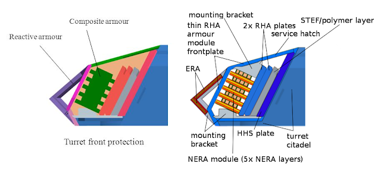
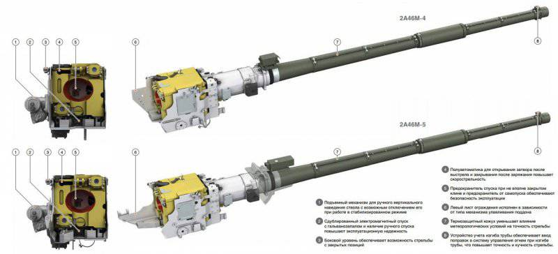
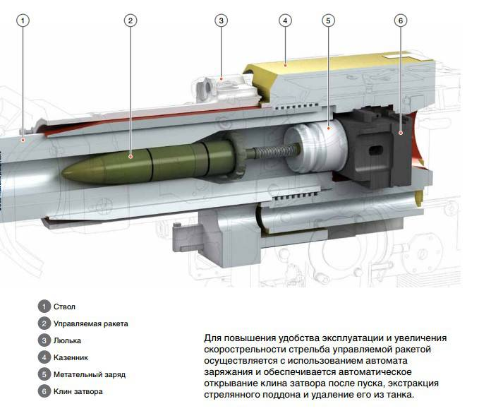
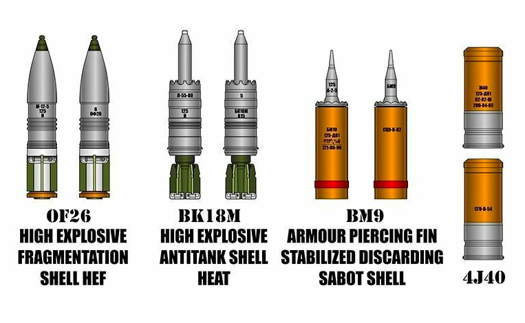
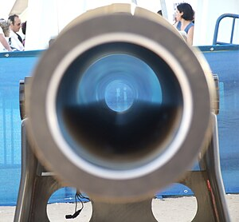

# Functional Specification

This functional specification is for the moonshot. For more information about the project, please look at the complete one, which describes the entire project.

    <h2 id="table of content">Table of content</h2>

<ul>
    <li><a href="#A_Project-Introduction">A) Project introduction<a></li>
    <ul>
        <li><a href="#1_Glossary">1) Glossary</a></li>
        <li><a href="#2_Project-Information">2) Project information<a></li>
        <ul>
            <li><a href="#Project-Overview">Project overview</a></li>
            <li><a href="#Objectives">Objectives</a></li>
            <li><a href="#Scope">Scope</a></li>
        </ul>  
    </ul>
    <li><a href="#B_Functional-Requirement">B) Functional requirement</a></li>
    <ul>
        <li><a href="#1_Simulation">1) Simulation</a></li>
        <li><a href="#2_Tanks-Details">2) Tanks details</a></li>
        <ul>
            <li><a href="#Armor">Armor</a></li>
            <li><a href="#Weight">Weight</a></li>
            <li><a href="#Mobility">Mobility</a></li>
            <li><a href="#Firepower">Firepower</a></li>
            <li><a href="#Others">Others</a></li>
        </ul>
    </ul>
    <li><a href="#C_Non-Functional-Requirement">B) Non functional requirement</a></li>
    <ul>
        <li><a href="#1_Costs">1) Cost</a></li>
        <ul>
            <li><a href="Expenditures">Expenditures</a></li>
            <li><a href="Time-Spent">Time Spent</a></li>
        </ul>
        <li><a href="#2_Reliability">2) Reliability</a></li>
        <li><a href="#3_Operability-And-Performance">3) Operability and performance</a></li>
        <li><a href="#4_Delivery">4) Delivery</a></li>
    </ul>
    <li><a href="#D_Annex">D) Annex</a></li>
</ul>

    <h2 id="A_Project-Introduction">A) Project introduction</h2>

<h3 id="1_Glossary">1) Glossary</h3>

| Term used | Definition |
|---|---|
| "Simulator" | Software that recreate the reality |
| "Tanks" | Armored vehicules, usualy mounted with a cannon and have tracks other than wheels (but some tank uses wheels) |
| "Sprockets" | Parts of a tank that is connected to the transmission and transfer the movement from the transimssion to the tracks |
| "Commander override" | Capability for the commander of the tank to completely take control on the turret |
| "Rifled" | For the cannon, it's how the interior of the cannon barel is made, rifled being the helical grooves machined into the internal surface (<a href="#A1_RifledGun">See the image of a rifled gun</a>) |
| "Smooth" | For the cannon, it's how the interior of the cannon barel is made, smooth being the fact of having a smooth surface in the interior of the cannon barel (<a href="#A2_SmoothboreGun">See the image of a smoothbore gun</a>) |

<h3 id="2_Project-Information">2) Poject information</h3>

<h4 id="Project-Overview"><ins>Project overview</ins></h4>
Two tank simulators already exist, Steel Beasts and GHPC, but one starts getting old and the other one is only for mid/late cold war era, also the felling of being like a tank crewman is missing. So this project is to make a complete renewal of them. The tank simulator will start with modern vehicles, wich are the more complex with a lot of different mechanics including electronics, firing assistance, commander override and more others.

<h4 id="Objectives"><ins>Objectives</ins></h4>
    <ul>
        <li>Create a tank simulator</li>
    </ul>

<h4 id="Scope"><ins>Scope</ins></h4>
This is for the moonshot goal, other goals will be clarified in an other document, for futur improvements.

| In scope |
|---|
| Have a working vehicle with basic mechanics and systems (can shoot and move) |
| Have a test map (shooting range/training map) |

| Out of scope |
|---|
| Use classified documents |
| Do not work like a simulator |
| Use complete pre-made models (taking complete models from internet) |

    <h2 id="B_Functional-Requirement">B) Functional Requirement</h2>

<h3 id="1_Simulation">1) Simulation</h3>
The goal of a simulator is to recreate as precisly as possible the reality. It means that everything has the be very close to how it works in the reality, depending on what is meant to recreate.

<h3 id="2_Tanks">2) Tanks</h3>
Tanks are very complex machines with a lot more technical specifications for the most modern vehicles than the first ones. Four main points have to be taken into account as shown here, but more technical specifications will be integrated in the future of the simulator.

<h4 id="Armor"><ins>Armor</ins></h4>
Tanks are, for most of them, equipped with heavy armor. For the most modern the armor has different layers, which are not there for nothing, but can have 100mm of armor effectiveness just by adding a panel of 30mm. It will be a complex part, because armor can redirect shells are just disintegrate the shell by taking into account the material used and other parameters.
  
<i>Example of composite armor on modern vehicles (here a chinese tank) :</i>

<h4 id="Weight"><ins>Weight</ins></h4>
Weight will not be a complex parameter to take into account, but its distribution will be important for the stability of the vehicles. Each armored vehicle has a different layout so the stability is not the same.

<h4 id="Mobility"><ins>Mobility</ins></h4>
For this to work, the weight, the engine power, the transmission, the sprockets, and the tracks (or wheels for wheeled vehicles) have to be taken into account. Those parameters are different for each vehicle because of the different materials and layout used for each one

<h4 id="Firepower"><ins>Firepower</ins></h4>
For the firepower, the type of cannon (rifled or smooth) and shells used are the main parameters to take into account. Tho some tank uses autoloader and others use manual loader.
  
<i>Example of a canon (here the russian 2A46 125mm canon) and the shells it uses :</i>

<h4 id="Others"><ins>Others</ins></h4>
Gunner sight with fire system, commander sight, and commandant controls, driver view with driving systems are more other specifications will be implemented (more details on the complete functional specification).

    <h2 id="C_Non-Functional-Requirement">C) Non functional requirement</h2>

<h3 id="1_Costs">1) Costs</h3>
<h4 id="Expenditures"><ins>Expenditures</ins></h4>
- Energie for the hardware

<h4 id="Time-Spent"><ins>Time Spent</ins></h4>
- Minimum of 6 hours per week, 306 hours in total for the year.

<h3 id="2_Reliability">2) Reliability</h3>
- Needs to be bug free 
- Should not crash

<h3 id="3_Operability-And-Performance">3) Operability and performance</h3>
- It will be developped for Windows OS, the other OS and game console are not the main goal 
- It will work at 60fps minimum for the type of machine used for developping (See the computer specifications in the folder "ComputerSpecificationsUsed") 
- Optimisation will be done as much as possible

<h3 id="4_Delivery">4) Delivery</h3>
- A launcher will be given to launch the simulator correctly

<h2 id="D_Annex">D) Annex</h2>

<i id="A1_RifledGun">Rifled Gun</i> 
 
<a href="#1_Glossary">Return to the glossary</a>  

<i id="A2_SmoothboreGun">Smoothbore Gun</i> 
 
<a href="#1_Glossary">Return to the glossary</a>  